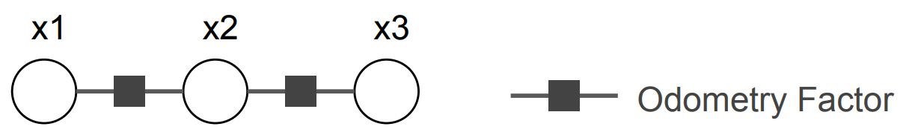
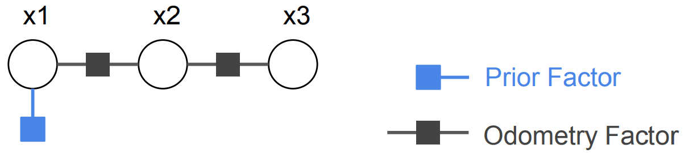

FAQ
===========================================

**Q: Why optimizing my factor graph returns non-success status** :code:`NonlinearOptimizationStatus.RANK_DEFICIENCY` **?**

A: The reason receiving a :code:`NonlinearOptimizationStatus.RANK_DEFICIENCY` is that :math:`J` is not full column rank, a.k.a. :math:`J^T J` is not full rank, thus normal equation :math:`J^T J \Delta x^{*} = J^T b` has no valid solution.

The reason :math:`J` is not full column rank is that the factor graph is not well constrained, generally due to missing factors.
A common example shown in following figure is a pose graph problem with only odometry factors. 

This factor graph is not well constrained, since given a valid solution :math:`\{x_1, x_2, x_3\}`, we can apply any rigid transformation :math:`T`, and :math:`\{Tx_1, Tx_2, Tx_3\}` is still a valid solution. To make a graph well constrained, we need to apply a prior on any of the pose (e.g. :math:`x_1`).

