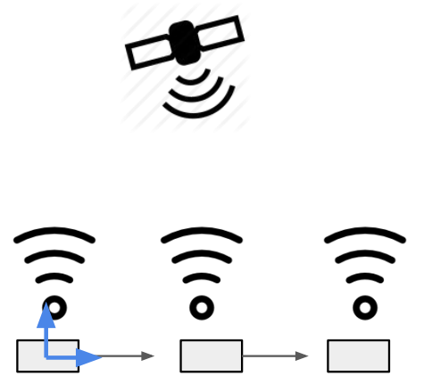
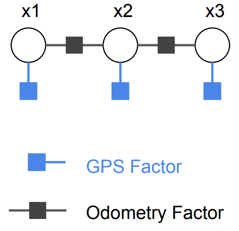
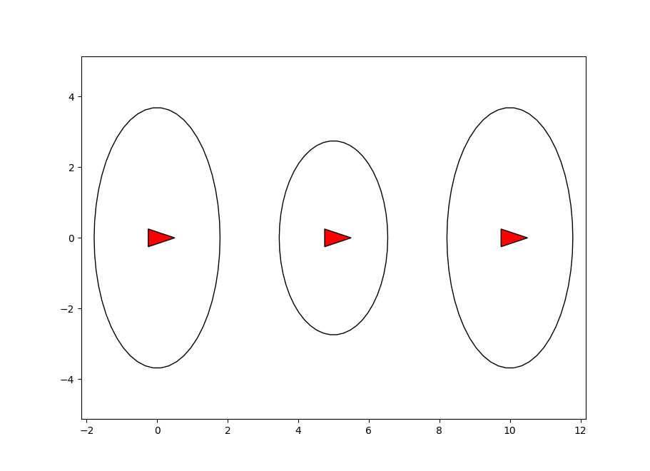

2D GPS-like Factor Example
===========================================

Python and C++ code of this example can be found at `gps_factor_example.py <https://github.com/dongjing3309/minisam/blob/master/examples/python/gps_factor_example.py>`_ and `gps_factor_example.cpp <https://github.com/dongjing3309/minisam/blob/master/examples/cpp/gps_factor_example.cpp>`_ respectively.

............................................................................

Here we give a simple example of how to define a 2D GPS-like factor and solve a pose graph problem with GPS-like measurement.
The problem is shown in figure below, where a vehicle moves forward on a 2D plane, and has a GPS-like measurement (the translation measurement) at each time stamp, 

If we define the system's state variables :math:`x = \{x_1, x_2, x_3\}`,
where :math:`x_i \in SE(2), i=1,2,3` is the vehicle pose at :math:`t=i`.
There are three types of factors: (1) Binary odometry factors, which encode the relative poses odometry measurements between :math:`t=i` and :math:`t=i+1`. (2) Unary GPS-like factor, which encodes the translation measurement at every :math:`t=i`.
Then the factor graph models the pose graph problem as

.. math::
   p(x) \propto \underbrace{p(x_1, x_2)p(x_2, x_3)}_\text{odometry}\underbrace{p(x_1)p(x_2)p(x_3)}_\text{GPS measurements} 
   :label: factor_graph_gps

which is shown in figure below.

If we define the GPS-like factor encodes translation measurement which has a Gaussian distribution, the probability distribution of a single factor is defined by

.. math::
   p_i(x_i) \propto \mathrm{exp} \big( - \frac{1}{2} \parallel f_i(x_i) \parallel^{2}_{{\Sigma}_i} \big)

Where :math:`\Sigma_i` is the measurement covariance of the Gaussian distribution, and the error function :math:`f_i(x_i)` is defined by

.. math::
   f_i(x_i) = \begin{bmatrix} p_x - m_x \\ p_y - m_y \end{bmatrix} 

Where :math:`p_x` and :math:`p_y` are X-Y coordinate of vehicle pose :math:`x_i`'s translation, and :math:`m_x` and :math:`m_y` are X-Y coordinate of translation measurement. The Jacobian of the error function is

.. math::
   \frac{\partial f_i(x)}{\partial x} = \begin{bmatrix} 1 & 0 & 0 \\ 0 & 1 & 0 \end{bmatrix} 

Python code example
---------------------------

Here we give a Python example on how to define the GPS-like factor.
To define a factor type in Python we need to define a class derived from factor base class :code:`minisam.Factor` (or :code:`minisam.NumericalFactor`), 
and has following member functions defined:

- :code:`copy(self)`: function returns a deep copy of factor.
- :code:`error(self, variables)`: error function :math:`f_i(x_i)`, returns error vector as a :code:`numpy.array`.
- :code:`jacobians(self, variables)`: Jacobian function :math:`\frac{\partial f_i(x)}{\partial x}`. return a list of Jacobian matrices in :code:`numpy.array`. This factor is not needed if this type is derived from :code:`minisam.NumericalFactor`, since the Jacobians will be calculated numerically. 
- :code:`__repr__(self)`: function to print the factor, returns a `string`. This function is optional to define. 

We can then define the GPS factor in Python

.. code:: python

   # GPS translation measurement factor
   class GPSPositionFactor(Factor):
       # ctor
       def __init__(self, key, point, loss):
           Factor.__init__(self, 1, [key], loss)
           self.p_ = point

       # make a deep copy
       def copy(self):
           return GPSPositionFactor(self.keys()[0], self.p_, self.lossFunction())

       # error
       def error(self, variables):
           pose = variables.at(self.keys()[0])
           return pose.translation() - self.p_

       # jacobians
       def jacobians(self, variables):
           return [np.array([[1, 0, 0], [0, 1, 0]])]

       # optional print function
       def __repr__(self):
           return 'GPS Factor on SE(2):\nprior = ' + self.p_.__repr__() + ' on ' + keyString(self.keys()[0]) + '\n'

The factor graph of this example can be built by

.. code:: python

   # factor graph container
   graph = FactorGraph()

   # Add odometry factors
   odomLoss = ScaleLoss.Scale(1.0) # odometry measurement loss function
   graph.add(BetweenFactor(key('x', 1), key('x', 2), SE2(SO2(0), np.array([5, 0])), odomLoss))
   graph.add(BetweenFactor(key('x', 2), key('x', 3), SE2(SO2(0),np.array([5, 0])), odomLoss))

   # Add the GPS factors
   gpsLoss = DiagonalLoss.Sigmas(np.array([2.0, 2.0])); # 2D 'GPS' measurement loss function, 2-dim
   graph.add(GPSPositionFactor(key('x', 1), np.array([0, 0]), gpsLoss))
   graph.add(GPSPositionFactor(key('x', 2), np.array([5, 0]), gpsLoss))
   graph.add(GPSPositionFactor(key('x', 3), np.array([10, 0]), gpsLoss))

Finally we can optimize the factor graph, and plot the estimated vehicle poses with marginal covariance.

