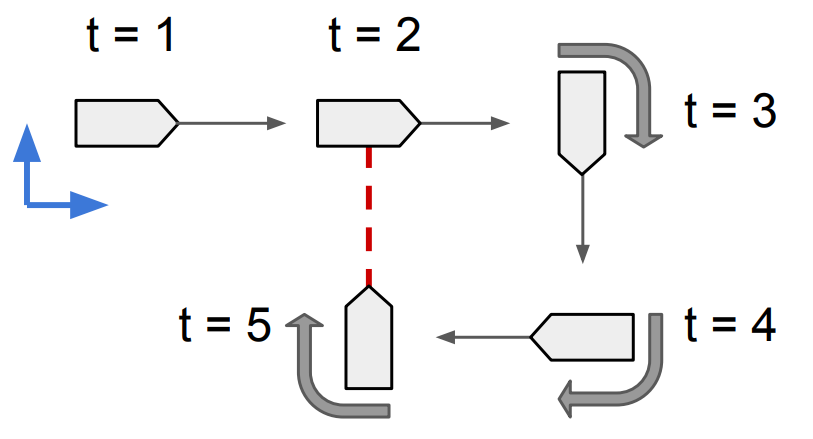
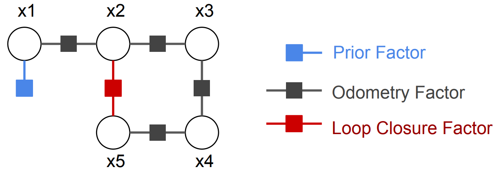
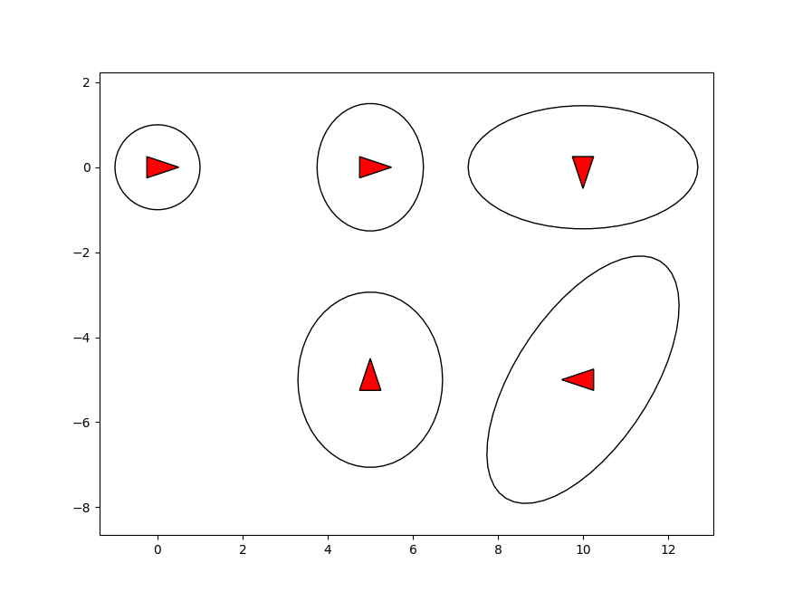

Simple 2D Pose Graph Example
===========================================

Python and C++ code of this example can be found at ... and ... respectively.

Here we give a simple example of using factor graph to solve a small 2D pose graph problem.
The problem is shown in figure below, where a vehicle moves forward on a 2D plane, makes a 270 degrees right turn, and has a relative pose loop closure measurement which is shown in red. 

If we want to estimate the vehicle's poses at times :math:`t=1,2,3,4,5`, we define the system's state variables

.. math::
   x = \{x_1, x_2, x_3, x_4, x_5\}, 
   :label: state_pg5

where :math:`x_i \in SE(2), i=1,2,3,4,5` is the vehicle pose at :math:`t=i`.
Then the factor graph models the pose graph problem as

.. math::
   p(x) \propto \underbrace{p(x_1)}_\text{prior}\underbrace{p(x_1, x_2)p(x_2, x_3)p(x_3, x_4)p(x_4, x_5)}_\text{odometry}\underbrace{p(x_2, x_5)}_\text{loop closure} 
   :label: factor_graph_pg5

which is shown in figure below.

As shown in Eq. :eq:`factor_graph_pg5` and the figure, there are three types of factors: (1) A prior factor, which gives a prior distribution on first pose, and locks the solution to a world coordinate frame. (2) Odometry factors, which encode the relative poses odometry measurements between :math:`t=i` and :math:`t=i+1`. (3) A loop closure factor, which encodes the relative poses measurement between :math:`t=2` and :math:`t=5`.

Python code example
---------------------------

Here we give a Python example on how to use miniSAM to solve the 2D pose graph example.

**1.** In the first step, we construct the factor graph. In miniSAM data structure :code:`FactorGraph` is used as the container for factor graphs.
In miniSAM each variable is indexed by a :code:`key`, which is defined by a character and an unsigned integer (e.g. :math:`x_1`).
Each factor has its key list that indicates the connected variables, and its loss function that has covariance :math:`\Sigma_i` and optional robust kernel :math:`\rho_i` (Cauchy and Huber robust loss functions have been implemented in miniSAM).

In the 2D pose graph example two types of factors are used: unary :code:`PriorFactor` and binary :code:`BetweenFactor`.

.. code-block:: python

   # factor graph container
   graph = FactorGraph()

   # Add a prior on the first pose, setting it to the origin
   priorLoss = DiagonalLoss.Sigmas(np.array([1.0, 1.0, 0.1])) # prior loss function
   graph.add(PriorFactor(key('x', 1), SE2(SO2(0), np.array([0, 0])), priorLoss))

   # Add odometry factors
   odomLoss = DiagonalLoss.Sigmas(np.array([0.5, 0.5, 0.1])) # odometry measurement loss function
   graph.add(BetweenFactor(key('x', 1), key('x', 2), SE2(SO2(0), np.array([5, 0])), odomLoss))
   graph.add(BetweenFactor(key('x', 2), key('x', 3), SE2(SO2(-1.57), np.array([5, 0])), odomLoss))
   graph.add(BetweenFactor(key('x', 3), key('x', 4), SE2(SO2(-1.57), np.array([5, 0])), odomLoss))
   graph.add(BetweenFactor(key('x', 4), key('x', 5), SE2(SO2(-1.57), np.array([5, 0])), odomLoss))

   # Add the loop closure constraint
   loopLoss = DiagonalLoss.Sigmas(np.array([0.5, 0.5, 0.1])) # loop closure measurement loss function
   graph.add(BetweenFactor(key('x', 5), key('x', 2), SE2(SO2(-1.57), np.array([5, 0])), loopLoss))

**2.** In the second step, we provide the initial variable values as the linearization point. In miniSAM variable values are stored in structure :code:`Variables`, where each variable is indexed by its key. 

.. code-block:: python

   # initial varible values for the optimization
   # add random noise from ground truth values
   initials = Variables()
   initials.add(key('x', 1), SE2(SO2(0.2), np.array([0.2, -0.3])))
   initials.add(key('x', 2), SE2(SO2(-0.1), np.array([5.1, 0.3])))
   initials.add(key('x', 3), SE2(SO2(-1.57 - 0.2), np.array([9.9, -0.1])))
   initials.add(key('x', 4), SE2(SO2(-3.14 + 0.1), np.array([10.2, -5.0])))
   initials.add(key('x', 5), SE2(SO2(1.57 - 0.1), np.array([5.1, -5.1])))

**3.** In the third step, we call a non-linear least square solver (like Levenberg-Marquardt) to solve the problem. Result variables are returned in a :code:`Variables` structure with status code.

.. code-block:: python

   # Use LM method optimizes the initial values
   opt_param = LevenbergMarquardtOptimizerParams()
   opt = LevenbergMarquardtOptimizer(opt_param)

   # result variables container
   results = Variables()
   status = opt.optimize(graph, initials, results)

   if status != NonlinearOptimizationStatus.SUCCESS:
       print("optimization error: ", status)

**4.** In the final step, other than optimized variables we can also calculate marginal covariances of vehicle poses if needed. Calculate marginal covariances we need the graph and optimized variables.

.. code-block:: python

   # Calculate marginal covariances for poses
   mcov_solver = MarginalCovarianceSolver()

   status = mcov_solver.initialize(graph, results)
   if status != MarginalCovarianceSolverStatus.SUCCESS:
       print("maginal covariance error", status)

   cov1 = mcov_solver.marginalCovariance(key('x', 1))

Finally we plot the estimated vehicle poses with marginal covariance

