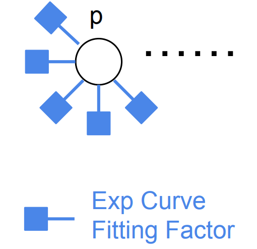
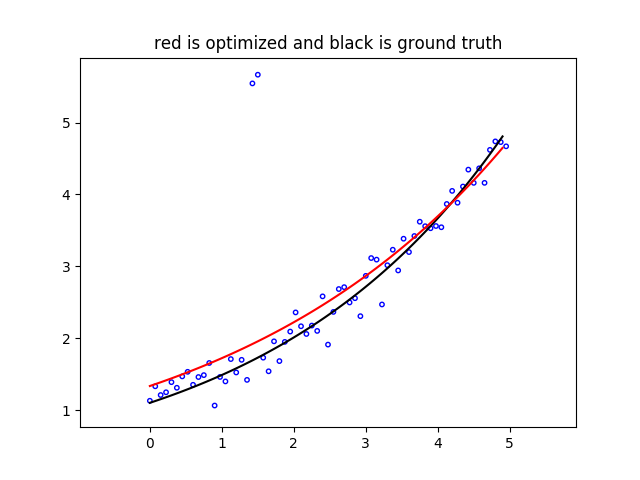
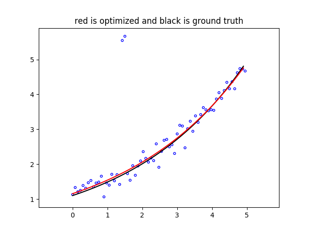

Robust Curve Fitting Example
===========================================

Python and C++ code of this example can be found at `robust_curve_fitting.py <https://github.com/dongjing3309/minisam/blob/master/examples/python/robust_curve_fitting.py>`_ and `robust_curve_fitting.cpp <https://github.com/dongjing3309/minisam/blob/master/examples/cpp/robust_curve_fitting.cpp>`_ respectively.

............................................................................

Here we give a simple example of how to solve a general least square problem in the framework of factor graph, even if the problem does not have a clear graph structure.

The problem we solve here is curve fitting, we are using the same exmaple shown on `Ceres tutorial <http://ceres-solver.org/nnls_tutorial.html#curve-fitting>`_. The input is a set of 2D points :math:`(x_i, y_i)`, and we are fitting a curve defined by exponential 

.. math::
  y = \exp(mx + c)

The curve fitting problem can be solved by solving non-linear least squares

.. math::
   m^{*}, c^{*} = \operatorname*{argmin}_{m, c} \sum_i \rho \big( \parallel y_i - \exp(mx_i + c) \parallel^{2} \big),

Where :math:`m` and :math:`c` are the curve parameters to optimize, and :math:`\rho` is a loss function.
We define a parameter variable vector :math:`p \in \mathbb{R}^2` to optimize

.. math::
   p = \begin{bmatrix} m \\ c \end{bmatrix}.

For curve fitting problem with :math:`N` points, the factor graph of the problem has only a single variable :math:`p`, and with :math:`N` unary factors connected to :math:`p`, which has a star structure, shown in figure below.

The error vector of the factor is defined by

.. math::
   f_i(p) =  y_i - \exp(m x_i + c),

and the Jacobian matrix is

.. math::
   \frac{\partial f_i(p)}{\partial p} = \begin{bmatrix} - x_i \exp(m x_i + c) \\ - \exp(m x_i + c) \end{bmatrix}.

Python code example
---------------------------

We first define the exponential curve fitting factor in Python

.. code:: python

   # exp curve fitting factor
   class ExpCurveFittingFactor(Factor):
       # ctor
       def __init__(self, key, point, loss):
           Factor.__init__(self, 1, [key], loss)
           self.p_ = point

       # make a deep copy
       def copy(self):
           return ExpCurveFittingFactor(self.keys()[0], self.p_, self.lossFunction())

       # error = y - exp(m * x + c);
       def error(self, variables):
           params = variables.at(self.keys()[0])
           return np.array([self.p_[1] - math.exp(params[0] * self.p_[0] + params[1])])

       # jacobians
       def jacobians(self, variables):
           params = variables.at(self.keys()[0])
           J_e_mc = np.array([[-self.p_[0] * math.exp(params[0] * self.p_[0] + params[1]), 
               -math.exp(params[0] * self.p_[0] + params[1])]])
           return [J_e_mc]

The graph is built by following code. In the example code we use key :math:`p_0` for the curve variable.

.. code:: python

   # build graph
   graph = FactorGraph()
   for d in data:
       graph.add(ExpCurveFittingFactor(key('p', 0), d, loss))

In the example we are using a 62 points datasets, in which 60 points are random generated points around ground truth curve, and 2 are outliers.
First we set loss function :math:`\rho` to identity, in the code we simply set loss function of factor to :code:`None`

.. code:: python

   # use None is no loss function is used
   loss = None

solve the problem and plot the fitted curve (in red) with data points (in blue) and ground truth curve (in black).

We can see that the result curve is biased towards to two outliers, since the error is driven by two outliers which have large errors.
If we use Cauchy robust loss function as :math:`\rho`, 

.. code:: python

   # use robust (Cauchy) loss function
   loss = CauchyLoss.Cauchy(1.0)

we get much better fitted curve.

