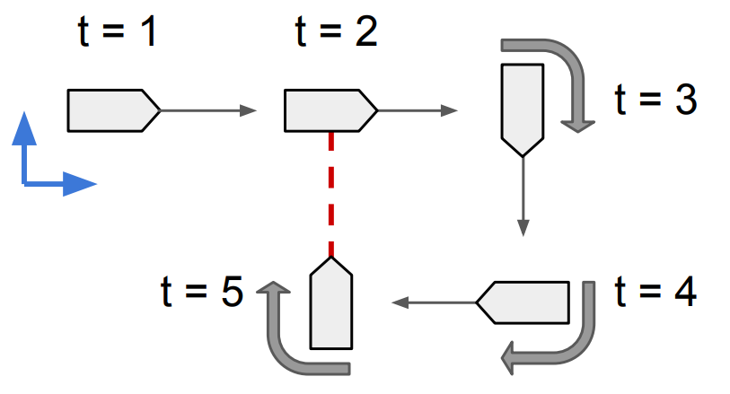
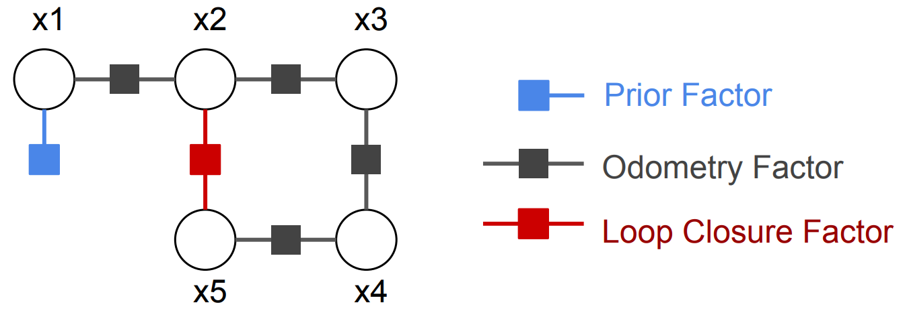

miniSAM subpage 1
===========================================

Test figure 1

Test figure 2

C++: [1]_

.. code-block:: c++

   void main() {
     return 0;
   }

Python:

.. code-block:: python

   def main:
       pass

Please cite:

.. code-block:: text

   @article{Li19arxivB,
                 author    = {Anqi Li and Ching-An Cheng and Byron Boots and Magnus Egerstedt},
     title     = {MStable, Concurrent Controller Composition for Multi-Objective Robotic Tasks,
     journal   = {CoRR},
     volume    = {abs/1903.12605},
     year      = {2019},
     url       = {http://arxiv.org/abs/1903.12605}
   }

.. rubric:: References

.. [1] Biskuppppppppppppp, J.; Dayal, U.; Bernstein, P.A..: Synthesizing independent database schemas. In: ACM SIGMOD 1979 Int. Conf. On Management of Data Proceedings, S. 143-151.
